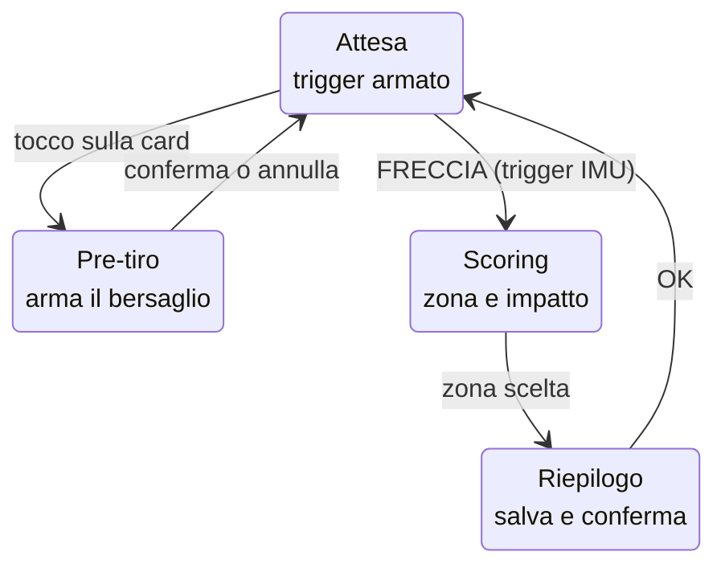
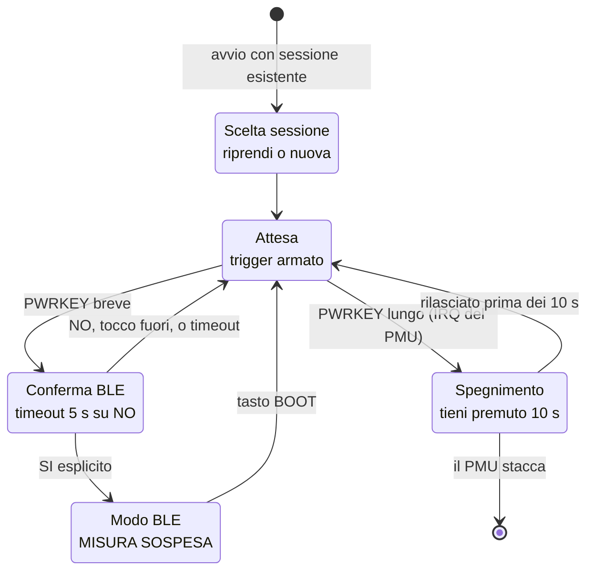
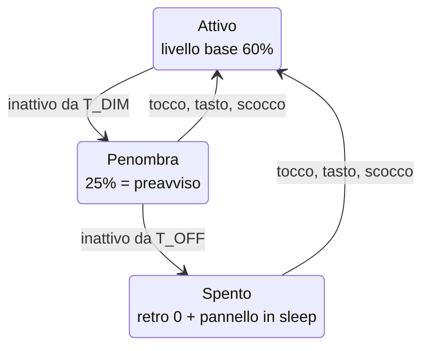
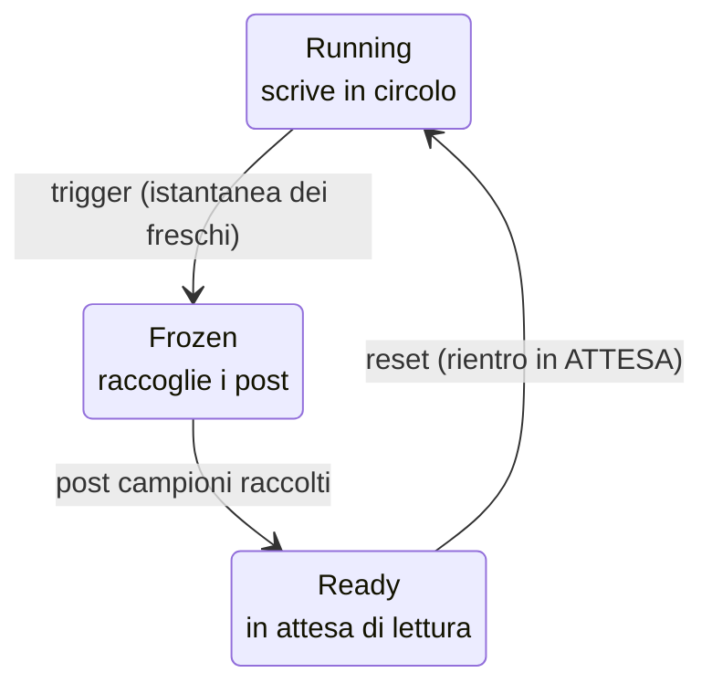

# ArchBB 1.83 — Le macchine a stati

Aggiornato alla Fase 24b.2 · settembre 2026

---

## Perché questo documento esiste

Fino alla Fase 22 il firmware aveva una macchina a stati sola, e stava in testa.
Dalla 24a ce ne sono **tre, indipendenti, che girano insieme**:

| macchina | dove vive | cosa la muove |
|---|---|---|
| `AppFlow` | `main.cpp` | i tocchi dell'arciere e lo scocco |
| `PowerStato` × `PowerProfilo` | `power_mgr.cpp` | il tempo di inattività |
| `BufferState` | `circular_buffer.cpp` | il trigger |

Ognuna è documentata dove vive. **Nessuna diceva cosa succede quando due si
muovono insieme** — ed è esattamente lì che sono nati gli ultimi due difetti:

- lo schermo che si spegne senza disarmare il trigger (comportamento *giusto*,
  ma che andava deciso e scritto, non lasciato emergere);
- il rinfresco periodico di `ATTESA` che cancellava la schermata di spegnimento,
  facendo mollare il tasto prima che il PMU arrivasse ai suoi dieci secondi
  (comportamento *sbagliato*, e nessuno l'aveva previsto perché le due cose
  vivono in due macchine diverse).

---

## 1. `AppFlow` — il ciclo di tiro

La transizione che conta è **`ATTESA -> SCORING`**: non la decide un tocco, la
decide una freccia. Tutto il resto dell'interfaccia può essere interrotto,
quella no.

Il pre-tiro è un'ansa laterale: si entra e si torna senza toccare la
registrazione. Il riepilogo rientra **sempre** in attesa, mai altrove.

---

## 2. `AppFlow` — le interruzioni, e le loro guardie

**Le guardie sono tutte diverse, e la differenza non è arbitraria.**

| stato | guardia | perché quella |
|---|---|---|
| Conferma BLE | timeout su NO; un tocco *fuori* dai pulsanti vale NO | dietro c'è la sospensione della misura: una freccia scoccata in modo BLE **non esiste** |
| Spegnimento | nessuna conferma, solo "tieni premuto" | lo decide il PMU in hardware; noi possiamo solo chiudere la sessione prima e dire quanto manca |
| Scelta sessione | raggiungibile solo all'avvio | non deve poter comparire per sbaglio a percorso iniziato |
| Pre-tiro | nessuna | non può fare danni: non tocca né la misura né i file |
| Toggle sessione (in attesa) | cooldown di 2 s | due tap ravvicinati non possono voler dire "apri e chiudi" |

### La regola che tiene insieme tutto

> **In ogni stato il trigger resta armato, tranne in `BLE_MODE`.**

Se una freccia parte durante la conferma BLE o durante il conto alla rovescia
dello spegnimento, si va in `SCORING` e l'interruzione decade. Uno strumento di
misura che smette di misurare mentre fa una domanda ha fallito il suo compito.

`BLE_MODE` è l'unica eccezione, ed è per questo che è l'unico stato con una
conferma esplicita davanti.

---

## 3. `PowerStato` — il risparmio energetico

Tre profili, perché non tutte le schermate sono uguali:

| profilo | attenua | spegne | stati `AppFlow` |
|---|---|---|---|
| `ATTESA` | 40 s | 100 s | `ATTESA` |
| `INTERATTIVO` | 90 s | **mai** | pre-tiro, scoring, riepilogo, scelta sessione, conferma BLE, spegnimento |
| `TRASFERIMENTO` | 40 s | 100 s | `BLE_MODE` |

`PENOMBRA` **non serve a risparmiare**: è il preavviso. Uno schermo che si
spegne di colpo sembra rotto.

`INTERATTIVO` non spegne mai perché quelle schermate si guardano mentre si
pensa, e hanno già un timeout proprio che le chiude.

### Interazioni da non dimenticare

- **Lo schermo spento non disarma niente.** `imu_task` e `trigger_task` non si
  fermano mai. La freccia che parte a pannello nero viene registrata come tutte
  le altre.
- **Il tocco che risveglia non è un comando.** `power_consume_risveglio()`. Senza
  questo, ogni risveglio in attesa aprirebbe o chiuderebbe una sessione a caso.
- **A pannello spento non si ridisegna.** Il rinfresco periodico di `ATTESA` è
  condizionato a `power_schermo_acceso()`.
- **Chi disegna una schermata che deve restare, deve avere uno stato.** Vedi il
  difetto dello spegnimento in 24b: disegnare e tornare in `ATTESA` significa
  farsi cancellare dal rinfresco entro tre secondi.

---

## 4. `BufferState` — il buffer circolare

Durante `FROZEN` e `READY` i push vengono **scartati**, ma `seq` continua a
correre. È il meccanismo che ha prodotto il difetto del 12/09: dopo il reset
l'anello conteneva ancora i campioni di prima del congelamento, e un trigger
scattato poco dopo il riarmo li includeva nella finestra pre.

Dalla 24b il contatore `s_freschi` dice quanti campioni appartengono davvero al
tiro corrente, e da 24b.1 sotto **un secondo** di campioni freschi gli angoli non
si calcolano affatto (`SHOT_ANGLE_PRE_MIN_MS`).

---

## 5. Come si aggiorna questo file

Ogni volta che si aggiunge uno stato ad `AppFlow` bisogna toccare **tre** punti,
e vale la pena elencarli perché il compilatore ne segnala solo uno:

1. l'`enum class AppFlow` in `main.cpp`;
2. `profiloPer()` — è uno `switch` senza `default`, quindi il compilatore
   avvisa: è l'unica delle tre a difendersi da sola;
3. **questo documento**, che invece non si difende affatto.

Il diagramma è in Mermaid e non in SVG proprio per questo: un diagramma in testo
si aggiorna con una riga, un SVG no — e diventerebbe la prima cosa a divergere
dal codice.
